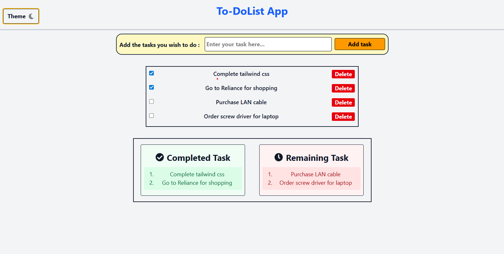
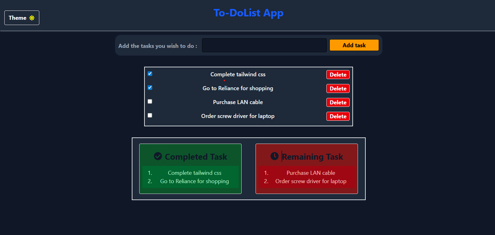

# 📝 To-Do App (React + TypeScript + TailwindCSS)

A simple **To-Do List App** built with **React, TypeScript, and TailwindCSS**.  
It allows users to **add, delete, mark tasks as completed/remaining**, and automatically **saves data in Local Storage** so tasks persist after refreshing.

## 🚀 Features

- ➕ Add new tasks
- ✅ Mark tasks as completed
- ⏱️ Track remaining tasks
- ❌ Delete tasks
- 💾 Persistent storage using **Local Storage**
- 📱 Responsive UI with TailwindCSS

## 🛠️ Tech Stack

- **React** (with Hooks)
- **TypeScript**
- **TailwindCSS**
- **Vite** (for fast development & build)

## 📂 Project Setup

### 1️⃣ Clone the repository

git clone https://github.com/your-username/todo-app.git
cd todo-app

2️⃣ Install dependencies
npm install
npm i react-icons

3️⃣ Run locally
npm run dev

App will be available at:
👉 http://localhost:5173/

4️⃣ Build for production
npm run build

## 📸 Screenshots

| 🌞 Light Mode                             | 🌙 Dark Mode                            |
| ----------------------------------------- | --------------------------------------- |
|  |  |

📌 Future Improvements
Add task editing
Add categories / tags
Add dark mode

👨‍💻 Author
Hafeez mohammad
GitHub: Hafeez-07
